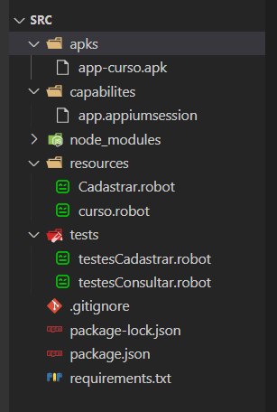
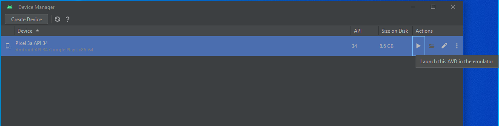

# Automação de testes Mobile com Robot Framework e Appium.

<h1 align="center">
    
</h1>

## 👨‍💻 Pré-requisitos de ambiente

Você vai precisar instalar as seguintes ferramentas e tecnologias:

- [Java JDK8](http://www.oracle.com/technetwork/pt/java/javase/downloads/jdk8-downloads-2133151.html) 8.202
- [Android Studio](https://developer.android.com/studio/index.html?hl=pt-br) 
- [Python](https://www.python.org/downloads/) 3.11.4
- [Node.js](https://nodejs.org/en/) 18.17.1
- [Appium](http://appium.io/downloads.html) >=2.1.3
- [Robot Framework](https://robotframework.org/) >=2

## 💻 Ferramentas

### Você pode baixar e instalar o JDK 8 através [desse link](http://www.oracle.com/technetwork/pt/java/javase/downloads/jdk8-downloads-2133151.html).

### Android Studio é a IDE oficial para desenvolvimento e testes de aplicativos para Android
- Você pode baixar a ultima através [desse link](https://developer.android.com/studio/index.html?hl=pt-br)

### No Linux ou Mac

Configure as seguintes váriávies de ambiente no **bash_profile** ou **zshrc** do seu Linux ou Mac:

```bash
export JAVA_HOME=$(/usr/libexec/java_home -v 1.8)
export ANDROID_HOME=~/Library/Android/sdk

PATH=$PATH:$ANDROID_HOME/platform-tools
PATH=$PATH:$ANDROID_HOME/tools
PATH=$PATH:$ANDROID_HOME/tools/bin
PATH=$PATH:$ANDROID_HOME/tools/lib
PATH=$PATH:$JAVA_HOME/bin
```

Para ZSH, execute o comando:

```bash
source ~/.zshrc
```

Para Bash, execute o comando:

```bash
source ~/.bashrc
```

### 🔖 Variáveis de ambiente no Windows

### Necessário configurar o **`ANDROID_HOME`** e **`JAVA_HOME`** no **`PATH`** do S.O.

### Pelo ***Virtual Device Manager*** do ***Android Studio***, crie um device.

### **Capabilities** configuradas no projeto de testes:

- Existe um arquivo já configurado na pasta no projeto, capabilitie, mas se precisar copiar daqui, fiquem avontade.

```
{
  "platformName": "Android",
  "deviceName": "Android Emulator",
  "automationName": "UIAutomator2",
  "app": "<caminho-do-projeto>/apks/app-curso.apk",
  "udid": "<emulador instalado no seu PC>",
  "autoGrantPermissions": true
}
```
[](https://youtu.be/ZsOq4xoTid0 "Variáveis de ambiente no Windows")


## ✅ ✅ Passo a passo para instalação e executar o projeto 

### Instalação do projeto 🚀 🚀

```bash
pip install -r requirements.txt
```

### Sugiro o uso de algum ambiente virtual (virtualenv) para isolar as bibliotecas utilizadas aqui, mas não tem problemas iniciar o projeto sem um ambiente virtual. Mais sobre [ambientes virtuais aqui](https://realpython.com/lessons/creating-virtual-environment/).

* Clonar o projeto:

```bash
git clone https://github.com/clarabez/appium-robot.git
```

* Existe um arquivo package.json já preparado pra instalar o appium e uiautomator2 para facilitar o uso da ferramenta.
  
```bash
npm install 
```

* Mas caso queria instalar tudo do zero, então siga os passos abaixo:
  
```bash
npm install appium@2.1.3
npm install appium-doctor
```

### Comandos para checagem do ambiente ✅ ✅

* Se o ambiente está OK:

```bash
npx appium-doctor --android
```
* Deve aprensentar um resultado similar ao da imagem abaixo:

<h1 align="left">
    
</h1>

* Se o driver está instalado:

```bash
npx appium driver list --installed
```

* Se o virtual device está ativo / online: **`adb devices`**

```bash
adb devices
```

### Organização do projeto

<h1 align="left">
    
</h1>

<ul>
    <li>material: Material da disciplina</li>
    <li>placafip-imgs: Imagens do primeiro projeto para visualização.</li>
    <li>src: Cógidos do projeto em questão</li>
    <li>apks: aplicativos em uso no projeto.</li>
    <li>capabilities: Pasta contendo o arquivo do capabilitie do projeto.</li>
    <li>.github: Imagens que estão sendo utilizadas para essa documentação inicial</li>
    <li>tests: fluxos de teste de cada tela da aplicação.</li>
    <li>requirements.txt: dependências do projeto.</li>
    <li>imagens: imagens do README.md</li>
    <li>imagens: imagens do README.md</li>
    <li>imagens: imagens do README.md</li>
</ul>


## 📱 Executando o Appium 
### Instruções 📢 ℹ️ 

- Inicie o Appium Server com o comando: 
```bash
npx appium server
```
- Se preferir rodar em background, use o comando:
```bash
npx appium server --unsafe-perm=true --allow-root
```
- Pra dar stop no serviço em background, use o comando:
```bash
npx appium &>/dev/null &
```
<h1 align="left">
    
</h1>

- Dê um play no Android Device Virtual.
<h1 align="left">
    
</h1>

- Execute o comando:
```bash
robot -d ./logs tests
```
- Enjoy. [doc](https://robotframework.org/);
- Made with ❤️ by Jean Carlos Figueiredo, .
